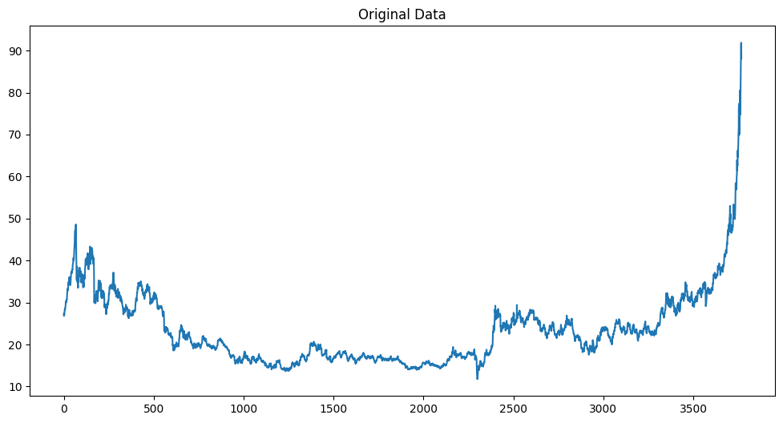
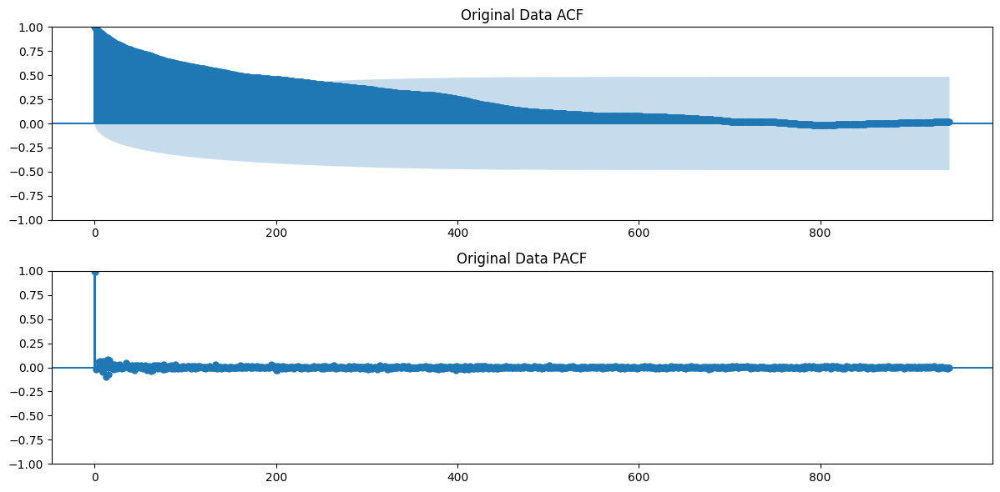
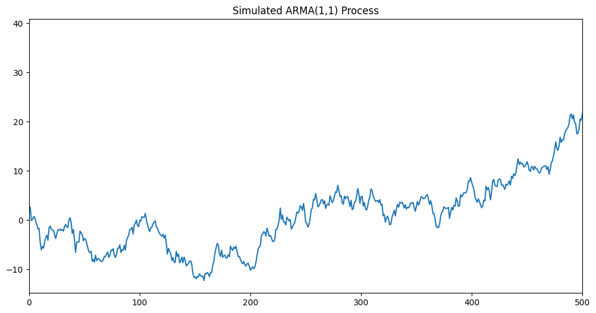
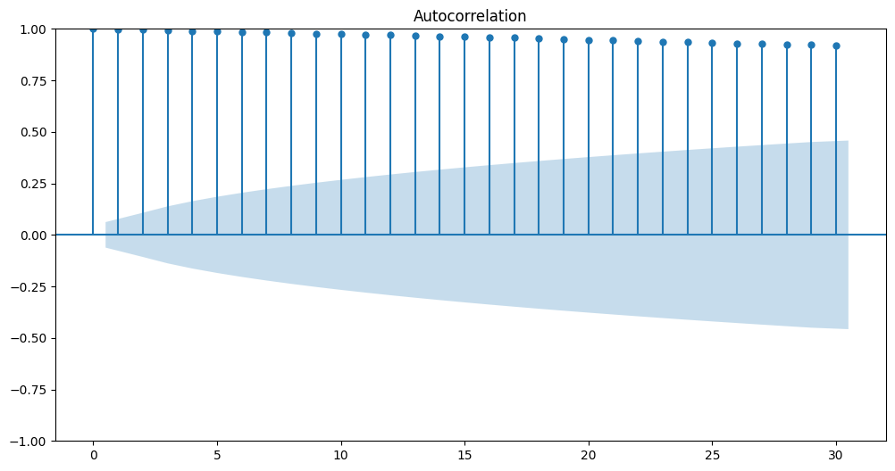
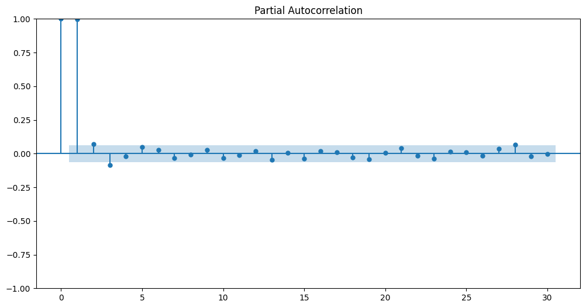
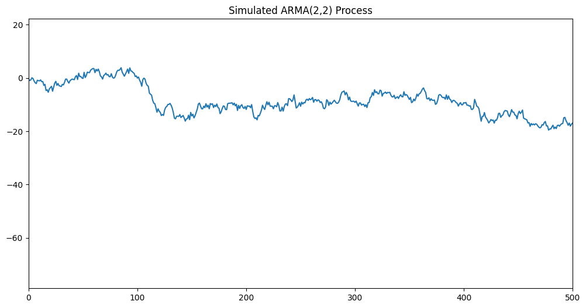
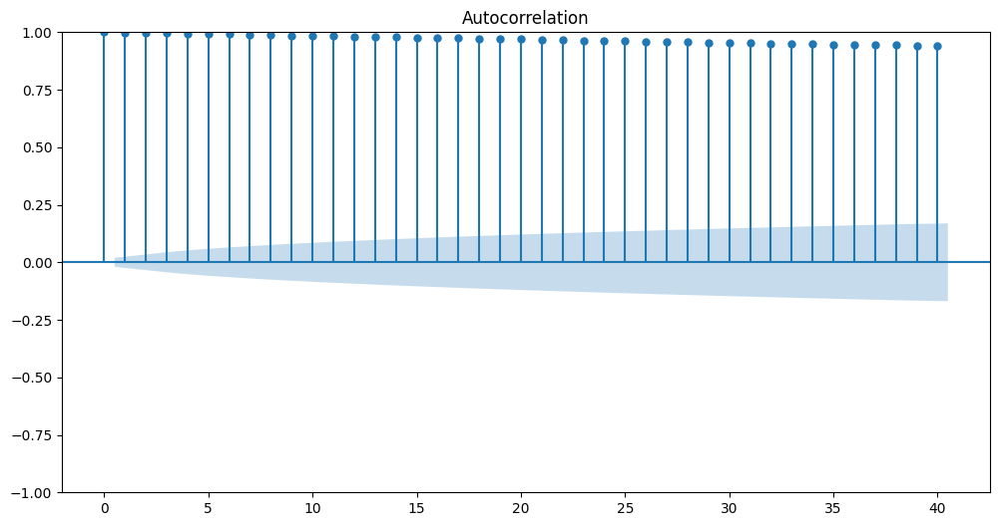
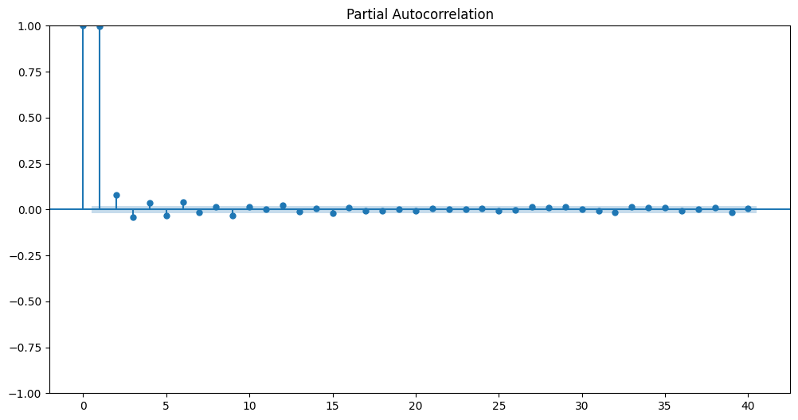

# Ex.No:04   FIT ARMA MODEL FOR TIME SERIES

# Date: 02.05.2026


# AIM:

To implement ARMA model in python.

# ALGORITHM:

1. Import necessary libraries.
2. Set up matplotlib settings for figure size.
3. Define an ARMA(1,1) process with coefficients ar1 and ma1, and generate a sample of 1000

data points using the ArmaProcess class. Plot the generated time series and set the title and x-
axis limits.

4. Display the autocorrelation and partial autocorrelation plots for the ARMA(1,1) process using
plot_acf and plot_pacf.

5. Define an ARMA(2,2) process with coefficients ar2 and ma2, and generate a sample of 10000 data points using the ArmaProcess class. Plot the generated time series and set the title and x-
axis limits.

6. Display the autocorrelation and partial autocorrelation plots for the ARMA(2,2) process using
plot_acf and plot_pacf.

# PROGRAM:

```python
import pandas as pd
import numpy as np
import matplotlib.pyplot as plt
from statsmodels.tsa.arima.model import ARIMA
from statsmodels.tsa.arima_process import ArmaProcess
from statsmodels.graphics.tsaplots import plot_acf, plot_pacf
data=pd.read_csv('silver_prices_data.csv')
N=1000
plt.rcParams['figure.figsize'] = [12, 6]
X=data['Price']
plt.plot(X)
plt.title('Original Data')
plt.show()
plt.subplot(2, 1, 1)
plot_acf(X, lags=len(X)/4, ax=plt.gca())
plt.title('Original Data ACF')
plt.subplot(2, 1, 2)
plot_pacf(X, lags=len(X)/4, ax=plt.gca())
plt.title('Original Data PACF')
plt.tight_layout()
plt.show()
arma11_model = ARIMA(X, order=(1, 0, 1)).fit()
phi1_arma11 = arma11_model.params['ar.L1']
theta1_arma11 = arma11_model.params['ma.L1']
ar1 = np.array([1, -phi1_arma11])
ma1 = np.array([1, theta1_arma11])
ARMA_1 = ArmaProcess(ar1, ma1).generate_sample(nsample=N)
plt.plot(ARMA_1)
plt.title('Simulated ARMA(1,1) Process')
plt.xlim([0, 500])
plt.show()
plot_acf(ARMA_1)
plt.show()
plot_pacf(ARMA_1)
plt.show()
arma22_model = ARIMA(X, order=(2, 0, 2)).fit()
phi1_arma22 = arma22_model.params['ar.L1']
phi2_arma22 = arma22_model.params['ar.L2']
theta1_arma22 = arma22_model.params['ma.L1']
theta2_arma22 = arma22_model.params['ma.L2']
ar2 = np.array([1, -phi1_arma22, -phi2_arma22])
ma2 = np.array([1, theta1_arma22, theta2_arma22])
ARMA_2 = ArmaProcess(ar2, ma2).generate_sample(nsample=N*10)
plt.plot(ARMA_2)
plt.title('Simulated ARMA(2,2) Process')
plt.xlim([0, 500])
plt.show()
plot_acf(ARMA_2)
plt.show()
plot_pacf(ARMA_2)
plt.show()

```

# Output

















RESULT:

Thus, a python program is created to fir ARMA Model successfully.
